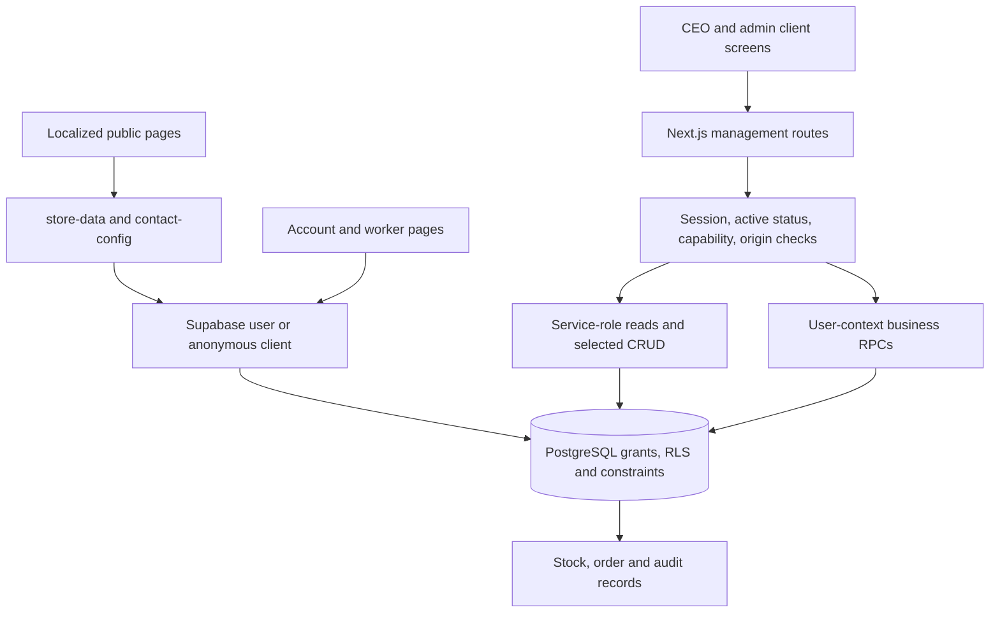

# MIRO project audit — 2026-09-28

Audited baseline: `160b310`, package version `0.0.3`. This is an assessment, not a remediation release. Application code and deployed migrations were not changed. The companion implementation brief is [IMPLEMENTATION_PROMPT_2026-09-28.md](IMPLEMENTATION_PROMPT_2026-09-28.md).

## Executive assessment

MIRO is a Hebrew-first security and communications business website connected to an internal operations console. Its intended customer journey is discover services → browse products → request advice/quote → staff follow-up. It also supports customer accounts, assigned worker requests, and staff-recorded sales. Public checkout is deliberately absent.

The foundation is substantial: authentication, role checks, database migrations, stock ledgers, product variants, sales snapshots, CEO controls, and bilingual themed screens exist. It is no longer merely the Phase 1 preview described by older documents. However, passing compilation and page-render tests does not mean the business workflows are reliable. The highest priorities are confidential catalog data exposure, product edits being silently discarded, tax scheduling, disconnected settings, reporting correctness, and enquiry follow-up.

Do not declare the platform ready for normal business operations until the P0/P1 findings below are resolved and verified through actual workflow tests. This does not call for a rewrite or a new framework.

## What exists and how it connects

| Area             | Implemented                                                                                                                 | Important limitation                                                                                                                  |
| ---------------- | --------------------------------------------------------------------------------------------------------------------------- | ------------------------------------------------------------------------------------------------------------------------------------- |
| Public website   | Home, services/detail, about, contact, legal drafts, catalog/category/detail; Hebrew RTL and English LTR; dark/medium/light | Business copy and imagery still require approval; no CMS for most public copy                                                         |
| Storefront       | Supabase products/categories/variants/images, search/filter/sort, galleries, saved products, role prices, enquiry links     | Pricing and selected-variant availability are inconsistent; production DB errors look like an empty catalog                           |
| Authentication   | Supabase signup/login/logout, email confirmation, recovery, server session checks                                           | Real inbox delivery and hosted auth configuration remain separate launch checks                                                       |
| Customer account | Profile, saved products, recent orders/invoices/requests                                                                    | Lists are small fixed slices; invoice issuance is not implemented; public contact submissions are not linked to the signed-in account |
| Worker area      | Assigned service requests and constrained status changes                                                                    | Limited operational context; no scheduling, field-service checklist, attachments or visit history                                     |
| Management       | Overview, products, inventory, suppliers, sales, customers, analytics, finance, users, requests, audit, settings            | Several screens are connected to incomplete or mismatched contracts                                                                   |
| CEO controls     | Password re-verification, add CEO, account role/status changes, delete ordinary accounts, guarded self-deletion             | No app-level CEO rate limiter; no controlled offboarding of another CEO                                                               |
| Database         | 20 migrations; RLS; audited security-definer RPCs; 4 SQL suites                                                             | Public column grants, public intake bypass, transaction gaps and concurrency concerns remain                                          |
| Commerce         | Manual sale creates order/items, immutable price/cost/VAT snapshots, conditional stock movement, audit                      | No retry idempotency, financial reversal flow, payments, checkout or implemented serial/lot allocation                                |

Architecture:

Useful boundaries are already present, but not consistently used. Route files and large client components contain substantial domain logic. Generated `database.types.ts` exists, while Supabase clients return unparameterized `SupabaseClient`, weakening compile-time protection. Security-definer RPCs correctly use the caller's client for many important writes; direct service-role CRUD bypasses RLS and therefore depends on route checks. Do not mistake a hidden button for authorization.

## Findings, ranked for implementation

### F01 — P0: public catalog permissions expose internal costs

**Confirmed in disposable PostgreSQL and by read-only anonymous queries against the configured live database.** No business values were printed or saved in the audit output.

`supabase/migrations/20260925140000_commerce_foundation.sql` grants whole-table SELECT on `products` and `product_variants` to public roles. The RLS policies restrict which rows are visible, not which columns. An anonymous client can select `products.purchase_cost`, `supplier_id`, `product_variants.cost_override`, and `supplier_sku` for visible products. `src/lib/store-data.ts` itself unnecessarily selects `cost_override`.

Impact: unauthenticated visitors can query internal procurement data outside the website UI. The live verification confirmed the sensitive-column queries succeed and return visible rows; it did not determine whether every visible cost value is populated.

Fix: define a public catalog projection and explicit column grants, or move private procurement fields into private tables. Revoke broad table SELECT before granting allowed columns. Preserve authenticated staff access through an authorized projection/RPC/service-only path. Audit customer-readable order items too: whole-row ownership policies must not expose `unit_cost` snapshots. Test direct PostgREST/SQL access, not just rendered HTML. Owner: backend/security engineer, immediate priority.

### F02 — P1: editing a product returns success without saving edited fields

**Confirmed by the UI/API control flow.** `product-management.tsx::submitForm` sends the entire form, including `status`, on every PATCH. `api/management/products/route.ts:170` removes `status` from `updateData`; every supplied status enters a publish/unpublish branch and returns before the regular update executes. Consequently names, descriptions, prices, category and other edits are discarded for ordinary editor saves. An already-active product can simply hit the publish RPC's early return and appear successfully saved.

Related: the creation form lets the operator select Active although the database requires products to be born as drafts; publishing error copy reads `err.details` although the API only returns `code: publish_incomplete` and a generic error.

Fix: distinguish field edits from explicit status transitions, or implement an atomic update-and-transition command. Reject unsupported mixed commands instead of silently ignoring fields. Save/reload every editor tab in tests, with draft and active products. Owner: catalog engineer.

### F03 — P1: tax scheduling can remove the currently applicable rate; UI misreports it

**Future-rate defect reproduced in disposable PostgreSQL; UI defect also observed in authenticated screenshots.** In `20260925140000_commerce_foundation.sql::set_tax_rate`, adding any new rate immediately sets all old rates `is_active=false`. Both `current_tax_rate` and `record_sale` require `is_active=true` and `valid_from <= current_date`. Scheduling a rate for next month therefore leaves no applicable rate today; `record_sale` falls back to zero.

Separately, `settings-panel.tsx` expects `TaxRate.is_current`, but `api/management/tax/route.ts` returns raw rows containing `is_active`. The screen shows `0.00%` and labels the actual stored rate Historical. This display bug alone does not mean current production sales are using zero tax.

Fix: define non-overlapping effective periods and one server-side rate resolver for a business date; do not silently treat missing configuration as an approved zero rate. Return an explicit current/scheduled/historical DTO. Preserve prior sale snapshots. Test scheduling, same-date replacement, invalid periods and date boundaries. Owner: database engineer; business/accounting owner approves the intended rate and date policy. This report assesses software behavior, not the legally applicable rate.

### F04 — P1: CEO settings save values that the business logic does not use

`settings-panel.tsx` offers inventory policies `deny`, `allow_backorder`, `notify_only`; product/storefront contracts use `inherit`, `keep_visible_contact`, `keep_visible_restock`, `hide_from_public`. `getStoreCatalog` does not resolve `inherit` from `inventory_defaults`; new variant thresholds default to zero instead of the saved setting. The finance screen accepts currency and VAT-inclusive toggles, while `record_sale` hardcodes ILS and VAT-inclusive arithmetic. Generic JSON settings accept structurally invalid values.

The public contact reader looks for `business_settings.public_contact`, but the settings API allowlist excludes that key and no CEO editor exists. If all three contact environment overrides are set, `getPublicContactConfig` skips the RPC and loses address/hours stored only there.

Fix: use one typed setting schema per key and trace every setting to its consumer. Disable unsupported financial options rather than storing misleading preferences. Add an approved contact editor and resolve environment precedence independently per field. Owner: settings/domain engineer.

### F05 — P1: financial, overview, analytics and inventory screens do not use the new aggregate RPCs

`api/management/finance/route.ts`, `analytics/route.ts`, `inventory/route.ts`, and `admin/page.tsx` still fetch rows and aggregate/filter in JavaScript. The migration already defines `management_sales_summary`, `management_analytics_overview`, and `management_inventory_list`, but there are no application calls to those RPC names.

Consequences:

- Totals and per-product results become incomplete when the API's row limit is reached. `.limit(10000)` is not an unlimited aggregate and should not be treated as one.
- Inventory low-stock filtering happens after pagination and `totalCount` is only the returned page length; relevant rows on later pages are missed.
- Inventory search builds a raw PostgREST OR string including related-table fields, with no structured validation/escaping. Treat the cross-table search syntax as needing a PostgREST integration test; this is not a claim of arbitrary SQL execution.
- Analytics totals suppress several query errors into zeros and count `sale` events although `record_sale` writes orders/audit, not analytics sale events.
- Overview sales exclusion uses `.not(..., "('cancelled','refunded')")`, unlike the usual PostgREST value syntax. Test this against actual cancelled/refunded fixtures before trusting it.
- Overview uses server-local date boundaries and finance uses UTC string day slicing; the business timezone is not an explicit contract.
- Without the service key, overview renders zeros with `hasErrors=false`.

Fix: wire authorized database aggregates and validated pagination to stable DTOs; extend existing RPCs where needed, including inventory valuation. Aggregate before limiting, use deterministic order, explicit business timezone/date intervals and truthful error states. Test well beyond the configured row cap. Owner: reporting engineer.

### F06 — P1: the normal analytics beacon loses its session ID

`components/analytics/track.ts:47` places `session_id` in JSON, and the preferred `sendBeacon` transport cannot set the custom header. `api/track/route.ts:53` reads only `x-miro-sid` or a `miro-sid` cookie; its zod schema strips the body field. The client does not create that cookie. The fetch fallback supplies the header, but the common beacon path stores a null session. Unique-session metrics are therefore unreliable even with small datasets.

Additionally, the RLS analytics insert policy accepts an arbitrary `user_id`. A local anonymous INSERT attributed a product view to another account successfully. That is activity-data forgery, not account impersonation or permission escalation. The persistent localStorage ID is effectively a browser identifier, with no documented expiry, not necessarily a session.

Fix: one bounded beacon/fetch contract; derive account identity from the trusted session; restrict direct inserts; define expiry/rotation/retention and test beacon separately. Count successful enquiries separately from clicks. Owner: analytics/backend engineer and privacy owner.

### F07 — P1: public intake bypasses application anti-abuse controls

The database grants `anon` INSERT on `service_requests` and `analytics_events`. Anyone using the publishable key can bypass Next.js origin checks, the in-memory enquiry limiter, honeypot and time trap by inserting directly through Supabase. Existing RLS limits payloads and triage fields, but is not rate limiting. This is distinct from the already-documented per-instance limiter weakness.

Fix: choose a trusted server/edge ingestion boundary, remove direct public table INSERT privileges and implement shared rate controls there (or enforce equivalent controls at every exposed DB entry). Check active-account status before a service-role intake insert, so the change does not accidentally re-enable blocked users. Preserve anonymous enquiries, privacy minimization and safe error envelopes. Do not treat an Origin header as bot authentication. Owner: backend/platform engineer.

### F08 — P1: saved enquiries cannot be fully worked from the Requests screen

`request-dashboard.tsx` selects only `id,name,message,status,assigned_worker_id`. Email, phone, timestamps, source and product/variant context are not shown to the operator. Public submissions leave `customer_id` null even for an authenticated customer, so they are absent from that customer's account and CRM history. The database accepts `waiting_customer`, but `/api/account` and `request-list.tsx` reject/omit it. Two assignment columns (`assigned_to`, `assigned_worker_id`) coexist, while UI/RPCs use the latter. The list stops at 100 without pagination or queue filtering.

Fix: a management request DTO/detail view with contact/context and clear assignment semantics; link authenticated submissions by verified user ID, never by an unverified email match; unify status types across SQL/API/UI. Validate that variant belongs to product. Retain minimum necessary worker visibility. Add a first-party notification/outbox only if owner-approved delivery is required; today persistence does not mean an email was sent. Owner: operations workflow engineer.

### F09 — P1: stock tracking semantics and lock ordering need correction

`record_sale` checks/deducts stock only when `tracking_mode <> 'none'`. Yet the documented meaning of `none` is simple quantity tracking, the UI presents it as ordinary non-serial stock, and new products default to it. Ordinary products can be sold repeatedly without stock decrement. Modes `serial` and `lot` have a table but no allocation/receiving workflow in the app or sale RPC.

The saved local defect probe confirmed two sales of a zero-stock `none` product succeed and leave stock unchanged. This is a reproduced implementation behavior; the business owner should confirm the intended distinction between untracked services and ordinary quantity-tracked goods.

There is also a concrete lock-order inversion: `record_sale` locks the variant row first, then calls `record_stock_movement`, which takes a variant advisory lock before locking the row. A concurrent adjustment can hold the advisory lock while waiting on the sale's row lock, while the sale waits for the advisory lock. PostgreSQL will abort a deadlock participant. This is a code-derived concurrency risk, not a claim that a production deadlock was observed; the current sequential SQL suites do not exercise it.

Fix: separate quantity tracking from serial/lot identification, migrate deliberately, and use the same deterministic advisory-lock-then-row-lock order across every mutation path. Add actual concurrent two-connection tests. Owner: database/inventory engineer.

### F10 — P1: sale retries can duplicate orders, and mistakes have no financial reversal workflow

`POST /api/management/sales` and `record_sale(p_customer,p_items)` have no idempotency key. A lost response followed by retry creates another order and possibly another stock deduction. UI busy state does not prevent retries across tabs or after network failure. Manual `customer_return` stock movements do not reverse the original order's financial totals.

The local probe confirmed two identical calls create two orders. Without a command identifier, the system cannot distinguish retry from a second intended sale.

Fix: a unique actor/command key with canonical request hash, transactional replay semantics and conflict on changed payload. Add an audited reversal/return workflow linked to original sale lines, with bounded return quantities and compensating ledger entries; do not erase sale history. Treat payment refunds as a separate future integration. Owner: commerce engineer; accounting owner approves correction semantics.

### F11 — P1: audit and multistep catalog writes are not consistently atomic

Product/category/image/role-price/variant CRUD often commits through the service client, then inserts `audit_events` separately without checking its error. An operation can succeed without its audit record. Variant create/update commits before `set_default_variant`; an RPC failure can return an error after the variant already changed.

Fix: transactionally authorized commands including audit and dependent mutations. Validate actor inside the trusted command, not from caller-supplied JSON. Keep prior before/after summaries appropriately bounded. Test forced audit/default failures roll back the entire change. Owner: backend/catalog engineer.

### F12 — P1/P2: storefront prices and stock disagree across surfaces

`getStoreCatalog` gives role price priority in `priceIls`, but `ProductDetailInteractive.tsx:73`, the detail page's offer calculation, and card dialog logic give variant price priority again. A role-priced item can have a different list and detail price. The base price passed to the detail component is already default-variant-resolved, so a different variant with no override may inherit the default variant's override rather than the raw product base. `sale_price`/`compare_at_price` are editable but absent from public reads. Selected-variant price/SKU changes while the passed server-rendered stock badge stays at aggregate product availability. Currency formatting rounds to whole shekels.

Fix: a documented pricing precedence resolved once on the server with an explicit public/role price contract; preserve the raw base separately; selected-variant availability; consistent precision. Do not publish private role prices in public structured data. Decide whether sale prices are supported or remove their misleading editor inputs. Owner: catalog/storefront engineer with business pricing approval.

### F13 — P1: authenticated accessibility failures; mobile settings clipping

Authenticated CEO scans and source review identified missing settings input/select associations, an overview `role=list` with no listitem children, and an icon-only mobile storefront link whose text is hidden without an accessible name. Shared overlay primitives exist but tax/product/customer workflows retain custom overlays; keyboard/focus behavior needs explicit coverage. Mobile settings screenshots visibly clip portions of the settings content even when the document-level overflow assertion reports false.

Initial theme-switch scans also flagged contrast; settled-theme measurements and evidence are recorded in the verification addendum below. Fix stable contrast failures rather than transient animation frames. Reuse the existing design tokens and Dialog/Drawer primitives. Preserve the premium black/yellow identity, both directions, all three themes, 320px support and reduced motion. Owner: frontend/accessibility engineer; manual screen-reader review remains required.

### F14 — P2: list pagination, error contracts and typing are incomplete

Users/customers fetch only the first 1000 auth accounts and independently fetch capped profiles/roles; missing matches turn into empty emails or customer defaults. Product catalog retrieval also fetches all products/variants/images without bounded pagination or detail-specific queries. Several management GETs still expose raw database error messages despite older status claims. Invalid zero prices/reorder quantities pass zod but violate database constraints. A failed secondary CRM query is shown as empty history. Private server modules and Supabase database typing are inconsistent.

Fix: validated query DTOs, deterministic server pagination/filtering, joined authorized directory projections, explicit errors per panel, shared safe error mapping and `SupabaseClient<Database>`. Fetch one product for detail/metadata and deduplicate repeated reads within a request. Add branded route error/loading states using the installed Next.js docs; this version's error docs use `retry`, so do not paste stale framework examples. Owner: platform/API engineer.

### F15 — P2: governance and operations need a current source of truth

The README/status/operations/design files contradict each other about Phase 1, contact availability, service-key requirements, landing destinations and migration rollout. Earlier assertions such as all reads being safe, all mutations being DB-authorized, and complete CEO smoke coverage are too broad. Existing admin smoke creates an admin, not a CEO; it tests navigation, not mutations. The repository has no `.github` CI workflow. Monitoring, restore rehearsal, retention enforcement, CEO emergency/offboarding procedures and production deployment evidence are not established by this audit.

Fix: a short authoritative current-state section with dated historical entries; automated isolated workflow gates; structured redacted errors; documented verified backup/restore, recovery and deploy/migration compatibility steps. Add second-factor/step-up and offboarding only with an explicit authority policy; never weaken last-CEO protections. Owner: lead/platform engineer and business owner.

### F16 — P2: public content and SEO still reflect the preview era

`sitemap.ts` hardcodes category routes and a September 20 timestamp, omitting live product detail URLs. Category slug normalization can collapse database categories into the same UI key. Public catalog outages become an indistinguishable empty state. Image APIs accept general URLs while Next Image allows any HTTPS host; there is no managed image upload/ownership pipeline. Most page content is code-managed, despite historical statements about later CEO editability.

Fix: live published-only sitemap and canonical slug strategy, distinct unavailable/empty states, approved media storage/host policy and bilingual alt text. A full CMS is an owner-scoped enhancement, not a prerequisite for repairing current transactions. Owner: storefront engineer and content owner.

## What is genuinely missing versus intentionally out of scope

Missing for a dependable internal business tool: actionable enquiry detail and queue, reliable financial/inventory reports, effective settings, transactional catalog updates/audits, sale retry protection, returns/corrections, meaningful authenticated mutation tests, monitoring, retention implementation and restore/offboarding procedures.

Partially scaffolded: serial/lot tracking, invoices, notifications, CRM for guest leads, reorder workflows, role pricing. Database tables or navigation labels do not establish working workflows. In particular, labels mentioning quotes/payments do not mean formal quote documents or payment collection exist.

Optional future scope requiring business decisions: online checkout/payment/shipping, tax-compliant invoice provider, supplier purchase orders, barcode scanner workflows, field-service scheduling/attachments, CMS, file uploads, marketing integrations and customer notifications. Preserve the current enquiry-only storefront unless the owner explicitly expands commerce scope.

## Verification performed in this audit

| Check                                                                  | Outcome and limits                                                                                                                                                                                                                              |
| ---------------------------------------------------------------------- | ----------------------------------------------------------------------------------------------------------------------------------------------------------------------------------------------------------------------------------------------- |
| `npm run lint`                                                         | PASS                                                                                                                                                                                                                                            |
| `npm run typecheck`                                                    | PASS                                                                                                                                                                                                                                            |
| `npm run format:check`                                                 | PASS at baseline                                                                                                                                                                                                                                |
| `npm audit --json`                                                     | PASS; registry reported zero known dependency vulnerabilities at audit time                                                                                                                                                                     |
| `python3 scripts/verify-database.py`                                   | PASS: all 20 migrations and all 4 SQL suites on disposable local PostgreSQL                                                                                                                                                                     |
| `PORT=3117 PLAYWRIGHT_BASE_URL=http://127.0.0.1:3117 npm run test:e2e` | PASS: production build and 22 browser/API tests                                                                                                                                                                                                 |
| Existing `verify-admin-console.mjs` on :3117                           | PASS: 14 navigation targets with disposable real admin; fixture account deleted                                                                                                                                                                 |
| Temporary CEO-role variant of that smoke                               | PASS navigation with disposable CEO; no business settings or sale mutations; fixture account deleted                                                                                                                                            |
| `verify-design.mjs`                                                    | FAIL overall: 60 layout combinations passed; quote-link assertion at line 381 expects product name but current URL carries UUID. This is an outdated assertion, not evidence of a broken quote route. Later interaction checks did not complete |
| Additional local SQL probes                                            | Confirmed anonymous private-column SELECT, forged analytics user attribution, and no effective current tax after scheduling a future rate                                                                                                       |
| Anonymous live read-only projection probes                             | Both sensitive product/variant column queries accepted, visible row returned; values not logged                                                                                                                                                 |
| Additional CEO UI inspection                                           | Both locales; overview/products/inventory/sales/settings/requests; desktop dark, phone light, tablet medium; screenshots inspected; failures detailed in F13/addendum                                                                           |
| Isolated recovery config                                               | PASS: 20 tests against the local Supabase protocol double; no real recovery email sent                                                                                                                                                          |
| Linked schema lint / migration history                                 | PASS using pinned npm CLI 2.118.0: no remote schema errors; all 20 local/remote migration IDs match. Initial unversioned commands hit a failing Homebrew binary (exit 137)                                                                      |

The isolated SQL harness emulates Supabase roles/auth functions in PostgreSQL; it does not emulate PostgREST, hosted auth, RLS gateway configuration, email or concurrent traffic. Existing tests passing does not refute the new probes. No production migrations were applied; no existing user, product, tax, order or inventory records were changed. Browser visits can produce the application's ordinary analytics; disposable auth fixtures were created and cleaned up. This is not a penetration-test certification, complete manual accessibility assessment or production load test.

## Verification addendum and saved evidence

After the isolated recovery tests, `npm run build` passed again using the actual local environment, restoring the build from the protocol-double configuration. Audit-created servers were stopped.

The settled-theme CEO scan covered 36 cases: 6 routes × 2 locales × 3 viewport/theme pairs (1440 dark, 390 light, 768 medium). It is not the full Cartesian combination of themes, widths and roles. Of these cases, 28 had at least one axe A/AA violation; 8 had none. The scan collector itself exits successfully after recording observations, so its exit code must not be represented as an accessibility pass.

Confirmed stable rules: `aria-required-children` (overview), `label` and `select-name` (settings), `link-name` (mobile storefront link), and `color-contrast` (medium CEO badge, bright-mode sales totals and tax-rate value). Many earlier contrast findings disappeared after waiting 600ms for theme transitions; those transient counts are excluded from the final finding.

All document-overflow checks reported false, but English phone settings had 6 controls extending beyond the viewport, and screenshot review confirms clipping. Product/inventory tables also had off-viewport controls at some widths; some may be legitimate horizontally scrollable content, so verify reachability and ancestor clipping before classifying each one as a defect.

Saved evidence:

- [Structured management observations](audit-evidence-2026-09-28/management-accessibility.json).
- [English phone settings](audit-evidence-2026-09-28/en-settings-390-light.png).
- [English desktop settings](audit-evidence-2026-09-28/en-settings-1440-dark.png).
- [Hebrew tablet settings](audit-evidence-2026-09-28/he-settings-768-medium.png).
- [Disposable-database defect probes](audit-evidence-2026-09-28/local-defect-probes.sql). Run only in the fresh local verification harness after migrations, never against a business database. Every boolean defect observation was true, including zero VAT on sales after future-rate scheduling. The probe transaction rolled back and the disposable cluster was stopped.

Screenshots show the disposable fixture account, not an owner's credentials. Initial broader screenshot output remains in `/tmp/miro-audit-design-20260928`; only selected management evidence is retained in the repository. The temporary CEO collector was removed after cleanup. Local server logs included `The destination stream closed early` during rapid browser navigation; root cause was not isolated and no corresponding page crash occurred in the smoke run. Track separately if it reproduces in normal browsing.

## Implementation order and owners

1. Backend/security: close F01 and direct-ingestion identity/grant defects in F06/F07 with compatible public projections.
2. Catalog/database: fix F02, F03, F04, F09, F10 and F11 with regression tests and explicit domain contracts.
3. Reporting/operations: wire F05 and F08, then unify F12 and pagination/error contracts.
4. Frontend/accessibility: repair F13 alongside functional work; verify every changed authenticated flow, not only home pages.
5. Lead/platform/content: reconcile docs, CI and operations; complete approved content and SEO.

Launch ownership: business/legal reviewer approves identity, claims, photography rights, privacy notices and retention for enquiries/customer activity; accounting owner approves financial semantics and any later invoice integration; accessibility reviewer completes keyboard, zoom and screen-reader checks; platform owner demonstrates backups, restoration and production auth delivery. These are outstanding approvals/actions, not a claim about specific legal obligations.
